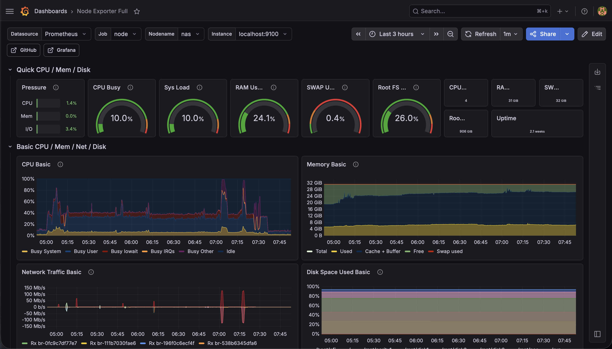
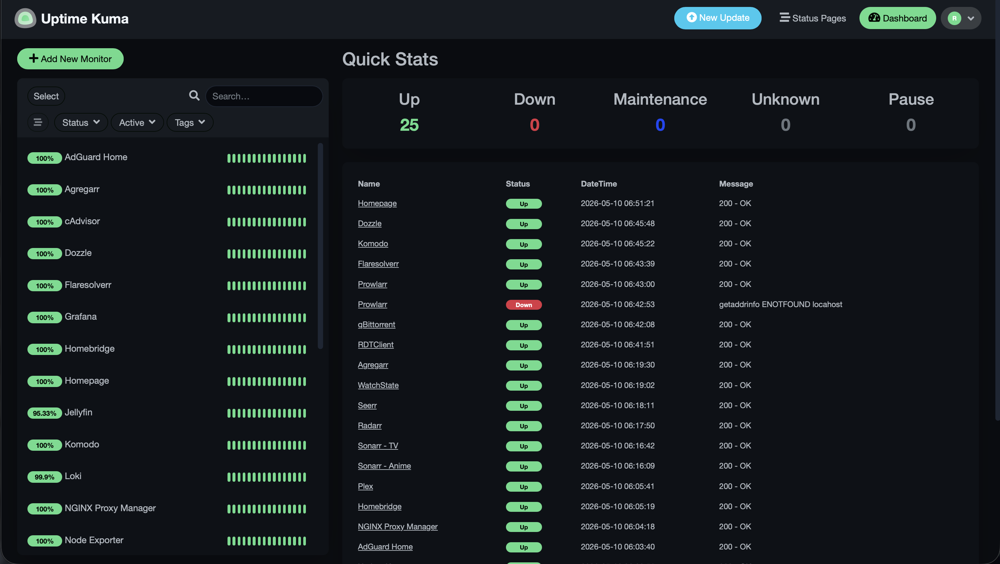

# Homelab

Production-grade self-hosted infrastructure running on a single-node Debian server, managed
via GitOps with full observability, centralized log aggregation, zero-trust networking, and
automated alerting.

[](https://github.com/rjdailey/homelab/actions/workflows/validate.yaml)

<p align="center">
  
  <br/>
  <em>8U rack — Unifi switch, Cloud Gateway, Intel N150 mini PC, DAS (45TB)</em>
</p>

## Hardware

| Component | Specification                             |
|-----------|-------------------------------------------|
| Rack      | 8U 10" Open Frame
| CPU       | Intel N150                                |
| RAM       | 32GB DDR4                                 |
| OS        | Debian 13 (Trixie)                        |
| Storage   | ~45TB usable (mergerFS + SnapRAID parity) |

## Stacks

| Stack      | Key Services                                  |
|------------|-----------------------------------------------|
| Monitoring | Prometheus, Grafana, Loki, Uptime Kuma        |
| Media      | Plex, Jellyfin, PlexAutoLanguages, Watchstate |
| Arr        | Sonarr, Radarr, Seerr                         |
| Downloads  | qBittorrent, Prowlarr, Gluetun                |
| Networking | AdGuard Home, NGINX Proxy Manager, Homebridge |

<details>
<summary>Full service list</summary>

| Stack      | Services                                                                              |
|------------|---------------------------------------------------------------------------------------|
| Monitoring | Prometheus, Grafana, Loki, Promtail, Uptime Kuma, cAdvisor, Node Exporter, Homepage  |
| Media      | Plex, Jellyfin, PlexAutoLanguages, Watchstate                                         |
| Arr        | Sonarr ×2, Radarr, Seerr, Agregarr                                                   |
| Downloads  | qBittorrent, RDTClient, Prowlarr, FlareSolverr, Gluetun                               |
| Networking | AdGuard Home, NGINX Proxy Manager, Homebridge                                         |

</details>

## Observability

- **Metrics** — Prometheus scrapes Node Exporter (host) and cAdvisor (containers) every 15s.
  Grafana dashboards cover host metrics (CPU, RAM, disk, network) and per-container resource usage.
- **Logs** — Promtail ships all container logs to Loki via Docker service discovery, tagged by
  container name, compose project, and log stream. Queryable in Grafana via LogQL.
- **Uptime** — Uptime Kuma monitors every service with HTTP health checks and tracks response
  time and uptime percentages.
- **Alerting** — Grafana alerts on disk usage >80%, memory pressure >85%, and container
  availability. Notifications route to Discord.

## Dashboards

<p align="center">
  
  
</p>

## Infrastructure

- **Orchestration** — Komodo syncs this repository and manages stack deployments via GitOps.
  Compose files are the source of truth. Changes are tested locally first, then promoted to
  Git and redeployed through Komodo.
- **Networking** — All services run on an internal Docker bridge network, exposed selectively
  via NGINX Proxy Manager with SSL termination. Host networking used only where technically
  required (AdGuard Home, Homebridge, Node Exporter).
- **VPN** — Gluetun manages a single WireGuard tunnel. qBittorrent, Prowlarr, and FlareSolverr
  route through it via `network_mode: service:gluetun`. Ports are exposed on the Gluetun
  container, not the individual services.
- **Secret Management** — Secrets are never committed to the repository. `.env` files are
  gitignored and managed on the host. `.env.example` files document required variables per
  stack. Application data is stored at `/opt/appdata` on the host, outside the repository.
- **Security** — SSH key-only auth, UFW firewall, no secrets in version
  control, host networking limited to services that require it.

## Storage

- **Storage** — mergerFS pools physical disks at `/mnt/nas` with
  most-free-space allocation. SnapRAID provides single-drive parity
  via snapraid-runner with safety thresholds. App data lives on the
  host SSD at `/opt/appdata` for fast random I/O.
- **Layout** — Media and torrent data live on the DAS at `/mnt/nas`. Application config and
  metadata live on the host SSD at `/opt/appdata` for fast random I/O.

## Repository Structure

```
stacks/
  monitoring/     # Prometheus, Grafana, Loki, Promtail, Uptime Kuma, cAdvisor, Node Exporter, Homepage
  media/          # Plex, Jellyfin, PlexAutoLanguages, Watchstate
  arr/            # Sonarr ×2, Radarr, Seerr, Agregarr
  downloads/      # qBittorrent, RDTClient, Prowlarr, FlareSolverr, Gluetun
  networking/     # AdGuard Home, NGINX Proxy Manager, Homebridge
```

## Roadmap

- [x] Observability stack (Prometheus, Grafana, Loki, Uptime Kuma, alerting)
- [x] CI/CD pipeline (GitHub Actions, self-hosted runner, Komodo integration)
- [ ] Secrets management (HashiCorp Vault)
- [ ] Kubernetes (k3s)
- [ ] Security hardening (Trivy, Fail2ban, network segmentation)
